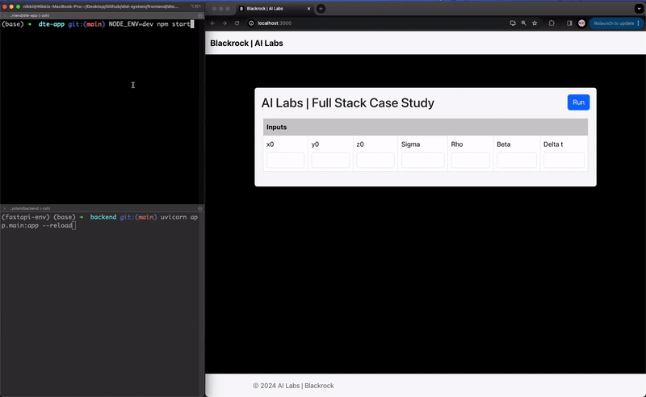

# Discrete Time Design System App []() [](https://github.com/nikitabijwe/dtd-system/blob/main/README.md)

## DTD System App 

- [FrontEnd](https://github.com/nikitabijwe/dtd-system/tree/main/frontend/dte-app) – React App.
- [Backend](https://github.com/nikitabijwe/dtd-system/tree/main/backend) – Python App.


## UserGuide

### Steps to run FrontEnd App 

```sh
cd frontend
cd dte-app
npm install
NODE_ENV=dev npm start
```

Then open [http://localhost:3000/](http://localhost:3000/) to see your app.<br>

### Steps to run Backend App 

```sh
cd backend
python3 -m venv fastapi-env
source fastapi-env/bin/activate
pip3 install -r requirements.txt
uvicorn app.main:app --reload
```

Then open [http://localhost:3000/](http://localhost:3000/) to see your app.<br>


### Folder Structure
```
frontend
├── dte-app
│   ├── public          
│   ├── src             
│   ├──  ├── actions 
│   ├──  ├── components
│   ├──  ├── reducers
│   ├──  ├── tests
│   ├──  ├── App.css
│   ├──  ├── App.js 
│   ├──  ├── ... 
│   ├──  package.json
│   ├──  ... 

...


backend
├── app
│   ├── api
│   ├── middleware
│   ├──     ├── cors
│   ├── models
│   ├── services
│   ├──     ├── simulate
│   ├── main.py
├── docs
├── requirements.txt
├── tests
│   ├── test_main.py
│   ├── test_middleware.py
│   ├── test_models.py
│   ├── test_services.py
```



